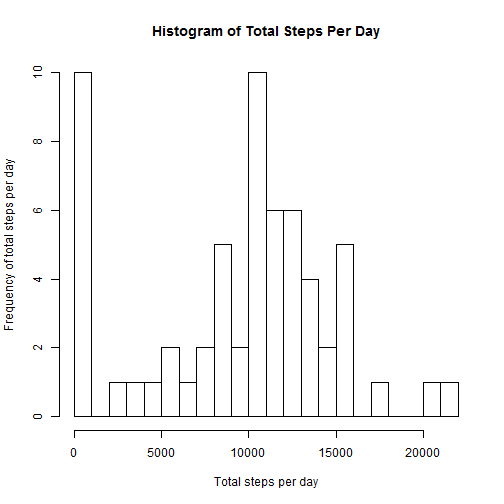
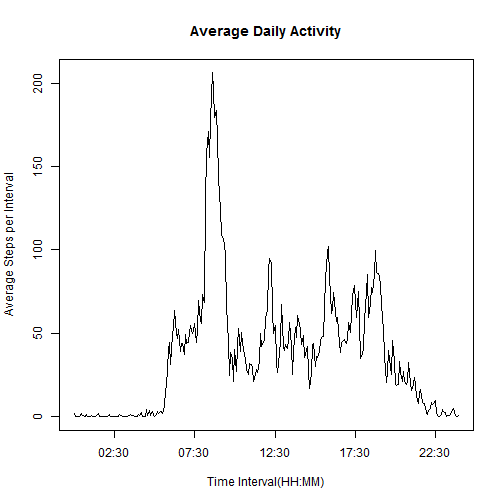
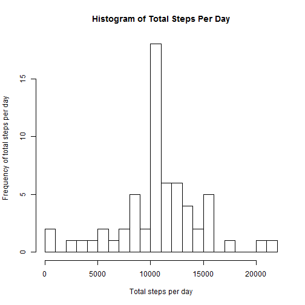
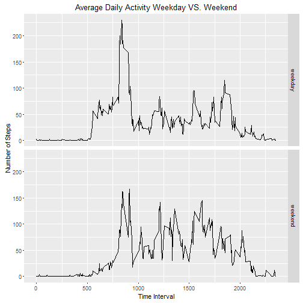

#1.Loading and preprocessing the data  
The data is compressed in a .zip file. So we need to first extract the file and then store the data in a dataset using read.csv(). The str() is used to see the structure of the data.

```r
filename <- unzip("activity.zip")
activityData <- read.csv(filename, stringsAsFactors = FALSE)
str(activityData)
```

```
## 'data.frame':	17568 obs. of  3 variables:
##  $ steps   : int  NA NA NA NA NA NA NA NA NA NA ...
##  $ date    : chr  "2012-10-01" "2012-10-01" "2012-10-01" "2012-10-01" ...
##  $ interval: int  0 5 10 15 20 25 30 35 40 45 ...
```

The 'date' variable is of type 'chr.' To properly format it, we use as.Date().

```r
activityData$date <- as.Date(activityData$date)
str(activityData)
```

```
## 'data.frame':	17568 obs. of  3 variables:
##  $ steps   : int  NA NA NA NA NA NA NA NA NA NA ...
##  $ date    : Date, format: "2012-10-01" "2012-10-01" ...
##  $ interval: int  0 5 10 15 20 25 30 35 40 45 ...
```

#2.What is mean total number of steps taken per day?  
First we calculate the total no. of steps per day.

```r
library(dplyr)
totalSteps_perDay <- activityData %>% group_by(date) %>% summarize(totalSteps = sum(steps, na.rm=TRUE))
head(totalSteps_perDay)
```

```
## # A tibble: 6 × 2
##         date totalSteps
##       <date>      <int>
## 1 2012-10-01          0
## 2 2012-10-02        126
## 3 2012-10-03      11352
## 4 2012-10-04      12116
## 5 2012-10-05      13294
## 6 2012-10-06      15420
```
Below is the histogram of total steps per day  

```r
hist(totalSteps_perDay$totalSteps, main="Histogram of Total Steps Per Day", xlab="Total steps per day", ylab = "Frequency of total steps per day", breaks = 20)
```


  
The mean of the total number of steps taken per day is:

```r
mean(totalSteps_perDay$totalSteps, na.rm=TRUE)
```

```
## [1] 9354.23
```
and the median of the total number of steps taken per day is:

```r
median(totalSteps_perDay$totalSteps, na.rm=TRUE)
```

```
## [1] 10395
```

#3.What is the average daily activity pattern?  
First we calculate the average no. of steps per 5-minute interval.

```r
avgSteps_perInterval <- activityData %>% group_by(interval) %>% summarize(avgSteps = mean(steps, na.rm=TRUE))
head(avgSteps_perInterval)
```

```
## # A tibble: 6 × 2
##   interval  avgSteps
##      <int>     <dbl>
## 1        0 1.7169811
## 2        5 0.3396226
## 3       10 0.1320755
## 4       15 0.1509434
## 5       20 0.0754717
## 6       25 2.0943396
```

Below is the time-series plot of the 5-minute interval (x-axis) and the average number of steps taken, averaged across all days (y-axis)

```r
strptime(sprintf("%04d", avgSteps_perInterval$interval), format="%H%M") %>%
        plot(avgSteps_perInterval$avgSteps, type="l", main="Average Daily Activity", xlab="Time Interval(HH:MM)", ylab="Average Steps per Interval")
```



Which 5-minute interval, on average across all the days in the dataset, contains the maximum number of steps?

```r
filter(avgSteps_perInterval,avgSteps== max(avgSteps))
```

```
## # A tibble: 1 × 2
##   interval avgSteps
##      <int>    <dbl>
## 1      835 206.1698
```
The interval 835 is the most active interval on average across all the days in the dataset. It corresponds to the highest peak on the above graph.

#4.Imputing missing values  
Note that there are a number of days/intervals where there are missing values (coded as NA). The presence of missing days may introduce bias into some calculations or summaries of the data.  
The total number of missing values in the dataset (i.e. the total number of rows with NAs) is:

```r
sum(is.na(activityData))
```

```
## [1] 2304
```
We create a new dataset where we replace the missing values of steps with the average number of steps for that 5-min interval.

```r
activityData_NoNA <- inner_join(activityData,avgSteps_perInterval,by="interval") %>%
        mutate(steps=ifelse(is.na(steps), avgSteps, steps)) %>%
        select(date,interval,steps)
head(activityData_NoNA)
```

```
##         date interval     steps
## 1 2012-10-01        0 1.7169811
## 2 2012-10-01        5 0.3396226
## 3 2012-10-01       10 0.1320755
## 4 2012-10-01       15 0.1509434
## 5 2012-10-01       20 0.0754717
## 6 2012-10-01       25 2.0943396
```

Now we calculate the total number of steps taken each day and create a histogram for the same.

```r
totalSteps_perDay_noNA <- activityData_NoNA %>% group_by(date) %>% summarize(totalSteps = sum(steps, na.rm=TRUE))
hist(totalSteps_perDay_noNA$totalSteps, main="Histogram of Total Steps Per Day", xlab="Total steps per day", ylab = "Frequency of total steps per day", breaks = 20)
```


  
The mean of the total number of steps taken per day is:

```r
mean(totalSteps_perDay_noNA$totalSteps, na.rm=TRUE)
```

```
## [1] 10766.19
```
and the median of the total number of steps taken per day is:

```r
median(totalSteps_perDay_noNA$totalSteps, na.rm=TRUE)
```

```
## [1] 10766.19
```
Replacing the missing values of steps with the average number of steps for that 5-min interval didn't affect the average steps but affected the mean and median of steps taken per day.

#5.Are there differences in activity patterns between weekdays and weekends?

For this part, we will use the weekdays() function to add a new factor variable to the dataset with two levels "weekday" and "weekend" indicating whether a given date is a weekday or weekend day.

```r
activityData_NoNA <- activityData_NoNA %>% 
        mutate(day=as.factor(ifelse(weekdays(date) %in% c("Saturday","Sunday"), "weekend", "weekday")))
head(activityData_NoNA)
```

```
##         date interval     steps     day
## 1 2012-10-01        0 1.7169811 weekday
## 2 2012-10-01        5 0.3396226 weekday
## 3 2012-10-01       10 0.1320755 weekday
## 4 2012-10-01       15 0.1509434 weekday
## 5 2012-10-01       20 0.0754717 weekday
## 6 2012-10-01       25 2.0943396 weekday
```

Then, the average number of steps per 5-minute interval is computed again.

```r
activity.pattern <- activityData_NoNA %>%
                    group_by(day,interval) %>%
                    summarize(avgSteps=mean(steps))
head(activity.pattern)
```

```
## Source: local data frame [6 x 3]
## Groups: day [1]
## 
##       day interval   avgSteps
##    <fctr>    <int>      <dbl>
## 1 weekday        0 2.25115304
## 2 weekday        5 0.44528302
## 3 weekday       10 0.17316562
## 4 weekday       15 0.19790356
## 5 weekday       20 0.09895178
## 6 weekday       25 1.59035639
```
Below is the panel plot containing a time series plot of the 5-minute interval (x-axis) and the average number of steps taken, averaged across all weekday days or weekend days (y-axis).

```r
library(ggplot2)
ggplot(activity.pattern, aes(interval,avgSteps)) + geom_line() + facet_grid(day~.) + labs(title="Average Daily Activity Weekday VS. Weekend", x="Time Interval", y="Number of Steps")
```


